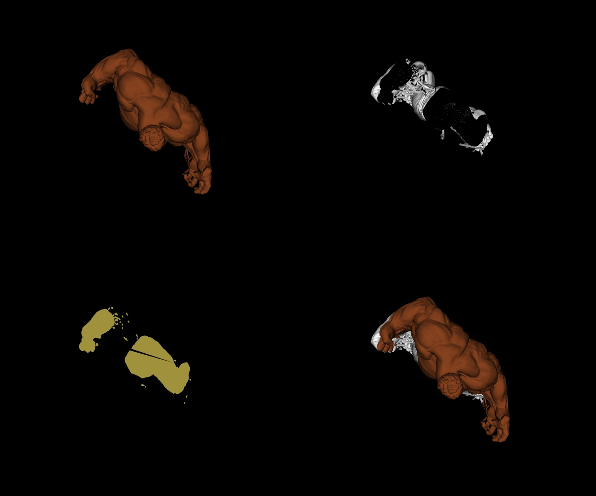
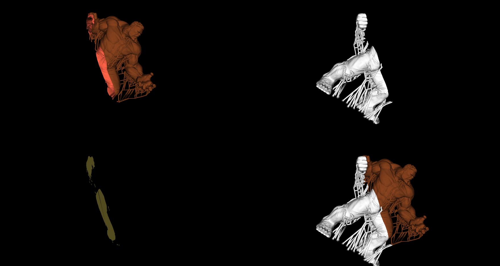
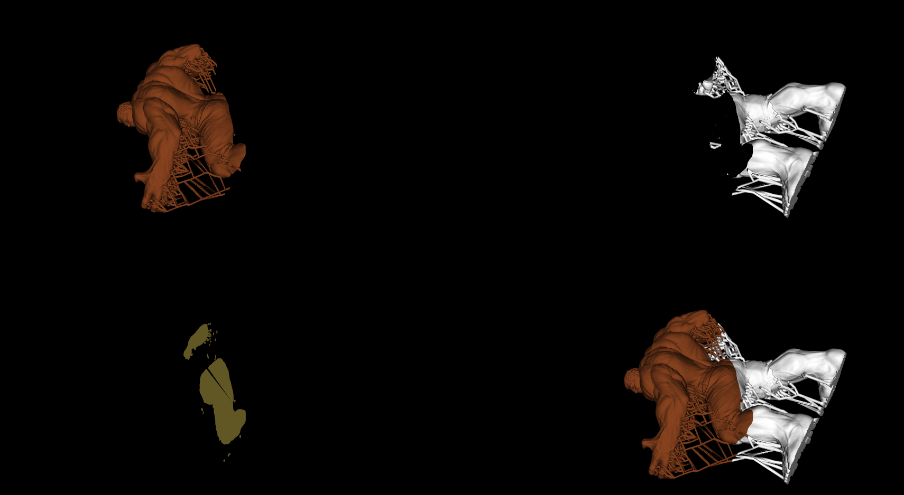

# Assignment 2 - README

## MM804 GRAPHICS AND ANIMATION

---

### About

Implicit Functions and Cropping

1. Read the model
2. Creating a plane
3. Clipping the data
4. Showing the intersection Area
5. Display the Plane to view all the port views of the model

Model used:

# https://www.thingiverse.com/thing:993933/files

### Output

The Original 3d object has a total of 2,708,574 vertices with each vertices having 3 co-ordinates x,y,z and the size of the file is 44Mb.
Clipped Out Model has a total of vertices - 1803089
Remaining part has a total of vertices - 901544
Intersection has a total of vertices - 3,940

### Link to the code

# https://github.com/grahul27/MM804-Assignment-2

### Reference to readme file

# https://github.com/grahul27/MM804-Assignment-2/blob/main/Readme.md

### Development Environment

- Python - 3.10.0
- VTK - 9.1.0
- OS - Windows 11

Object and texture files used to rendered - Hulk.stl

### How to run

1. Open file Assignment2.ipynb either in Google Colab or Jupyter-Notebook and execute cell wise for the output window to render
